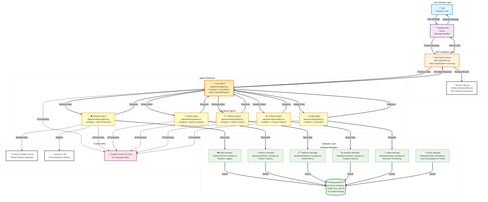

# Weight Loss Tracker & Coach Chat Agent 🤖

A conversational AI-powered Telegram bot that helps users track their weight loss journey through nutrition, fitness, and wellness logging with autonomous nudges and personalized recommendations.


## ⚠️ Important Disclaimer

**THIS BOT DOES NOT PROVIDE MEDICAL ADVICE OR PROFESSIONAL HEALTH GUIDANCE**

- This application is for informational and tracking purposes only
- AI systems can make mistakes and provide inaccurate information
- Always consult qualified healthcare professionals for medical advice
- Use this tool cautiously and at your own risk
- The developers are not responsible for any health-related decisions made based on this bot's output

## 🌟 Features

This Telegram bot is a friendly, privacy-first AI weight loss companion designed to make healthy habits easier to build and track. It lets users log meals, workouts, water intake, sleep, and daily steps in a conversation—without judgment, tedious apps, or spreadsheets. With gentle nudges, smart batch processing, and weekly progress reports, it adapts to each user's goals and schedule. The bot supports dietary restrictions, respects privacy, and recovers intelligently from errors or ambiguities, making it a trustworthy partner for sustainable weight management and wellness.

### ✅ Completed Features
- **Conversational Onboarding**: Step-by-step profile setup with personalized calorie goals (recently fixed and tested)
- **User Profile Management**: Secure storage of demographics, goals, and preferences
- **Health-Focused Validation**: BMI checks, safe calorie ranges, and wellness guardrails
- **Multi-Agent AI System**: Google ADK-powered agent framework with specialized sub-agents
- **Advanced Tool Integration**: Custom and built-in tools for nutrition analysis, fitness tracking, and wellness correlations
- **Session Management**: Persistent conversation state with intelligent context handling
- **Comprehensive Observability**: Structured logging, error handling, and performance monitoring
- **Google ADK Integration**: Full agent development kit implementation with lazy loading and error handling
- **Database Layer**: Complete SQLite persistence with SQLAlchemy ORM and data managers
- **Telegram Bot Integration**: Production-ready bot with webhook support and graceful degradation
- **Nutrition Tracking**: Enhanced meal logging with improved USDA API integration and batch processing
- **Fitness Logging**: Advanced workout tracking with volume calculations and progression suggestions
- **Wellness Monitoring**: Comprehensive sleep, water intake, and step counting with correlations
- **Autonomous Nudges**: Scheduled reminders to maintain consistent habits
- **Progress Analytics**: Enhanced daily/weekly summaries with trends and insights
- **Production Features**: Docker deployment, health checks, and monitoring

## 🏗️ Architecture & Implementation

### Overall System Architecture



### Agent Interaction Patterns

```mermaid
graph TD
    %% Root Agent as Central Coordinator
    subgraph "Root Agent (Coordinator)"
        ROOT[🎯 Root Agent<br/>agents/root/agent.py<br/>LlmAgent + Coordinator<br/>Intent: General/Support]

        subgraph "Root Agent Tools"
            INTENT[🎯 Intent Classifier<br/>Classify user message intent]
            SENT[😊 Sentiment Detector<br/>Analyze emotional state]
            FMT[📝 Response Formatter<br/>Format Telegram responses]
            BATCH[📦 Batch State Manager<br/>Handle multi-item conversations]
        end
    end

    %% Specialized Agents
    subgraph "Specialized Agents"
        NUTR[🍽️ Nutrition Agent<br/>agents/nutrition/agent.py<br/>Meal logging & nutrition analysis]
        FIT[💪 Fitness Agent<br/>agents/fitness/agent.py<br/>Workout tracking & progression]
        WELL[😴 Wellness Agent<br/>agents/wellness/agent.py<br/>Sleep, water, steps tracking]
        ANAL[📊 Analytics Agent<br/>agents/analytics/agent.py<br/>Progress reports & trends]
        NUDGE[🔔 Nudge Agent<br/>agents/nudge/agent.py<br/>Reminders & habit building]
    end

    %% ADK Integration Layer
    ADK[🔄 ADK Agent Runner<br/>adk_integration.py<br/>Routes messages to appropriate agents]

    %% Session Management
    SESS[💾 Session Service<br/>InMemorySessionService<br/>Maintains conversation context]

    %% Interaction Patterns
    subgraph "Agent Interaction Patterns"
        SEQ[🔄 Sequential Processing<br/>Root → Sub-Agent → Response]
        TOOL[🛠️ Tool Execution<br/>Agent → Tool → Database]
        STATE[💾 State Preservation<br/>Context maintained across agents]
        ROLE[🎭 Role Separation<br/>Each agent handles one domain]
        HANDOVER[🤝 Context Handover<br/>State transfer between agents]
    end

    %% Message Flow Examples
    subgraph "Message Routing Examples"
        MSG1["💬 'I ate 2 eggs and toast'"]
        MSG2["💬 'Did 3 sets of squats'"]
        MSG3["💬 'Slept 7 hours last night'"]
        MSG4["💬 'Show me my progress'"]
        MSG5["💬 'Hello, how are you doing?'"]
    end

    %% Agent Communication Flow
    ADK -->|"Classify Intent"| ROOT
    ROOT -->|"Nutrition Intent"| NUTR
    ROOT -->|"Fitness Intent"| FIT
    ROOT -->|"Wellness Intent"| WELL
    ROOT -->|"Analytics Intent"| ANAL
    ROOT -->|"General Intent"| ROOT

    %% Tool Usage by Root Agent
    ROOT -->|"Use Tool"| INTENT
    ROOT -->|"Use Tool"| SENT
    ROOT -->|"Use Tool"| FMT
    ROOT -->|"Use Tool"| BATCH

    %% Session Management
    ADK -->|"Manage Session"| SESS
    ROOT -->|"Access Context"| SESS
    NUTR -->|"Access Context"| SESS
    FIT -->|"Access Context"| SESS
    WELL -->|"Access Context"| SESS
    ANAL -->|"Access Context"| SESS
    NUDGE -->|"Access Context"| SESS

    %% Response Flow Back to Root
    NUTR -->|"Nutrition Response"| ROOT
    FIT -->|"Fitness Response"| ROOT
    WELL -->|"Wellness Response"| ROOT
    ANAL -->|"Analytics Response"| ROOT
    NUDGE -->|"Nudge Response"| ROOT

    %% Message Routing Examples
    MSG1 -->|"Classified as NUTRITION"| ADK
    MSG2 -->|"Classified as FITNESS"| ADK
    MSG3 -->|"Classified as WELLNESS"| ADK
    MSG4 -->|"Classified as ANALYTICS"| ADK
    MSG5 -->|"Classified as GENERAL"| ADK

    ADK -->|"Route"| ROOT
    ROOT -->|"Delegate"| NUTR
    ROOT -->|"Delegate"| FIT
    ROOT -->|"Delegate"| WELL
    ROOT -->|"Delegate"| ANAL

    %% Pattern Explanations
    SEQ -.->|"Root receives, routes to sub-agent, gets response"| ROOT
    TOOL -.->|"Agents use specialized tools for domain tasks"| NUTR
    STATE -.->|"Conversation context preserved across agent switches"| SESS
    ROLE -.->|"Each agent has single responsibility"| NUTR
    HANDOVER -.->|"State transferred when switching agents"| ADK

    %% Styling
    style ROOT fill:#ffecb3,stroke:#ff6f00,stroke-width:3px
    style ADK fill:#fff3e0,stroke:#e65100,stroke-width:2px
    style SESS fill:#e8f5e8,stroke:#2e7d32,stroke-width:2px

    %% Subgraph styling
    classDef agentClass fill:#fff9c4,stroke:#f57c00,stroke-width:2px
    classDef toolClass fill:#f3e5f5,stroke:#7b1fa2,stroke-width:1px
    classDef patternClass fill:#e3f2fd,stroke:#1976d2,stroke-width:1px
    classDef messageClass fill:#fff3e0,stroke:#ef6c00,stroke-width:1px

    class NUTR,FIT,WELL,ANAL,NUDGE agentClass
    class INTENT,SENT,FMT,BATCH toolClass
    class SEQ,TOOL,STATE,ROLE,HANDOVER patternClass
    class MSG1,MSG2,MSG3,MSG4,MSG5 messageClass
```



### Agent Tools & Capabilities

```mermaid
flowchart LR
 subgraph CoreTools["Core Tools - Available to All Agents"]
        INTENT["🎯 Intent Classifier<br>tools/intent_classifier.py<br>Gemini-powered intent detection"]
        SENT["😊 Sentiment Detector<br>tools/sentiment_detector.py<br>Emotional state analysis"]
        FMT["📝 Response Formatter<br>tools/response_formatter.py<br>Structured Telegram responses"]
        BATCH["📦 Batch State Manager<br>tools/batch_state_manager.py<br>Multi-item conversation handling"]
  end
 subgraph NutrTools["Nutrition Tools"]
        N_PARSER["🍽️ Batch Parser<br>tools/nutrition/batch_parser.py<br>Food item extraction"]
        N_CALC["🧮 Calculator<br>tools/nutrition/calculator.py<br>USDA + Nutritionix APIs"]
        N_MANUAL["✏️ Manual Entry<br>tools/nutrition/manual_entry.py<br>Fallback calorie input"]
        N_STORE["💾 Meal Storage<br>tools/nutrition/meal_storage.py<br>Database operations"]
  end
 subgraph FitTools["Fitness Tools"]
        F_PARSER["🏋️ Batch Parser<br>tools/fitness/batch_parser.py<br>Exercise processing"]
        F_CALC["📊 Calculator<br>tools/fitness/calculator.py<br>Volume &amp; progression"]
        F_STORE["💾 Workout Storage<br>tools/fitness/workout_storage.py<br>Database operations"]
  end
 subgraph WellTools["Wellness Tools"]
        W_PARSER["💧 Parser<br>tools/wellness/wellness_logger.py<br>Health metric extraction"]
        W_CORR["🔗 Correlations<br>tools/wellness/correlations.py<br>Health pattern analysis"]
  end
 subgraph AnalTools["Analytics Tools"]
        A_CALC["📈 Calculator<br>tools/analytics/calculator.py<br>Progress metrics"]
        A_TRENDS["📉 Trends<br>tools/analytics/trends.py<br>Historical analysis"]
        A_HERO["🏆 Hero Stats<br>tools/analytics/hero_stats.py<br>Achievement highlights"]
  end
 subgraph NudgeTools["Nudge Tools"]
        NU_SCHED["⏰ Scheduler<br>tools/nudge/scheduler.py<br>Timezone-aware timing"]
        NU_GEN["🎨 Generator<br>tools/nudge/generator.py<br>Personalized messages"]
        NU_STREAK["🔥 Streak Tracker<br>tools/nudge/streak_analyzer.py<br>Habit consistency"]
  end
 subgraph External["External APIs"]
        USDA["🌽 USDA FoodData Central"]
        NUTRIX["🥗 Nutritionix Fallback"]
        GEMINI["🤖 Google Gemini 2.5 Flash"]
  end
    ROOT["🎯 Root Agent<br>Coordinator"] --> INTENT & SENT & FMT & BATCH
    NUTR["🍽️ Nutrition Agent<br>Meal Processing"] --> N_PARSER & N_CALC & N_MANUAL & N_STORE
    FIT["💪 Fitness Agent<br>Workout Analysis"] --> F_PARSER & F_CALC & F_STORE
    WELL["😴 Wellness Agent<br>Health Tracking"] --> W_PARSER & W_CORR
    ANAL["📊 Analytics Agent<br>Progress Reports"] --> A_CALC & A_TRENDS & A_HERO
    NUDGE["🔔 Nudge Agent<br>Reminders"] --> NU_SCHED & NU_GEN & NU_STREAK
    NUTR -.-> CoreTools
    FIT -.-> CoreTools
    WELL -.-> CoreTools
    ANAL -.-> CoreTools
    NUDGE -.-> CoreTools
    N_CALC --> USDA & NUTRIX
    INTENT --> GEMINI
    SENT --> GEMINI
    FMT --> GEMINI
    style ROOT fill:#ffecb3,stroke:#ff6f00,stroke-width:3px
    style INTENT fill:#e1f5fe,stroke:#01579b,stroke-width:1px
    style SENT fill:#e1f5fe,stroke:#01579b,stroke-width:1px
    style FMT fill:#e1f5fe,stroke:#01579b,stroke-width:1px
    style BATCH fill:#e1f5fe,stroke:#01579b,stroke-width:1px
    style NUTR fill:#fff9c4,stroke:#f57c00,stroke-width:2px
    style N_PARSER fill:#f3e5f5,stroke:#7b1fa2,stroke-width:1px
    style N_CALC fill:#f3e5f5,stroke:#7b1fa2,stroke-width:1px
    style N_MANUAL fill:#f3e5f5,stroke:#7b1fa2,stroke-width:1px
    style N_STORE fill:#f3e5f5,stroke:#7b1fa2,stroke-width:1px
    style FIT fill:#fff9c4,stroke:#f57c00,stroke-width:2px
    style F_PARSER fill:#f3e5f5,stroke:#7b1fa2,stroke-width:1px
    style F_CALC fill:#f3e5f5,stroke:#7b1fa2,stroke-width:1px
    style F_STORE fill:#f3e5f5,stroke:#7b1fa2,stroke-width:1px
    style WELL fill:#fff9c4,stroke:#f57c00,stroke-width:2px
    style W_PARSER fill:#f3e5f5,stroke:#7b1fa2,stroke-width:1px
    style W_CORR fill:#f3e5f5,stroke:#7b1fa2,stroke-width:1px
    style ANAL fill:#fff9c4,stroke:#f57c00,stroke-width:2px
    style A_CALC fill:#f3e5f5,stroke:#7b1fa2,stroke-width:1px
    style A_TRENDS fill:#f3e5f5,stroke:#7b1fa2,stroke-width:1px
    style A_HERO fill:#f3e5f5,stroke:#7b1fa2,stroke-width:1px
    style NUDGE fill:#fff9c4,stroke:#f57c00,stroke-width:2px
    style NU_SCHED fill:#f3e5f5,stroke:#7b1fa2,stroke-width:1px
    style NU_GEN fill:#f3e5f5,stroke:#7b1fa2,stroke-width:1px
    style NU_STREAK fill:#f3e5f5,stroke:#7b1fa2,stroke-width:1px
    style USDA fill:#e8f5e9,stroke:#2e7d32,stroke-width:1px
    style NUTRIX fill:#e8f5e9,stroke:#2e7d32,stroke-width:1px
    style GEMINI fill:#fce4ec,stroke:#880e4f,stroke-width:2px
```



### Conversation Flows & Error Handling

```mermaid
sequenceDiagram
    participant U as 👤 User
    participant T as 🤖 Telegram Bot
    participant ADK as 🔄 ADK Runner
    participant ROOT as 🎯 Root Agent
    participant NUTR as 🍽️ Nutrition Agent
    participant TOOLS as 🛠️ Tools
    participant DB as 📊 Database
    participant API as 🌽 External APIs

    %% Normal Conversation Flow - Nutrition Example
    rect rgb(240, 255, 240)
        Note over U,API: Normal Conversation Flow - Meal Logging
        U->>T: "I ate 2 eggs and toast"
        T->>ADK: process_message()
        ADK->>ADK: classify_intent("nutrition")
        ADK->>ROOT: route_to_agent(nutrition_agent)

        ROOT->>NUTR: transfer_to_agent()
        NUTR->>TOOLS: parse_meal_batch()
        TOOLS->>API: lookup_nutrition_usda()
        API-->>TOOLS: nutrition_data
        TOOLS->>TOOLS: calculate_nutrition()
        TOOLS->>DB: store_meal_log()
        DB-->>TOOLS: meal_id

        NUTR->>ROOT: "Logged: 305 cal, 18g protein"
        ROOT->>ADK: format_response()
        ADK->>T: send_to_user()
        T->>U: ✅ Breakfast logged! 305 calories, 18g protein
    end

    %% Normal Conversation Flow - Fitness Example
    rect rgb(255, 248, 240)
        Note over U,API: Normal Conversation Flow - Workout Logging
        U->>T: "Did 3 sets of squats 80kg"
        T->>ADK: process_message()
        ADK->>ADK: classify_intent("fitness")
        ADK->>ROOT: route_to_agent(fitness_agent)

        ROOT->>FIT: transfer_to_agent()
        FIT->>TOOLS: parse_workout_batch()
        TOOLS->>TOOLS: calculate_volume()
        TOOLS->>DB: store_workout_log()
        DB-->>TOOLS: workout_id

        FIT->>ROOT: "Logged: 2400 volume units"
        ROOT->>ADK: format_response()
        ADK->>T: send_to_user()
        T->>U: 💪 Workout logged! Great strength work!
    end

    %% Error Flow - API Failure with Fallback
    rect rgb(255, 240, 240)
        Note over U,API: Error Handling Flow - API Failure
        U->>T: "Ate chicken breast and rice"
        T->>ADK: process_message()
        ADK->>ROOT: route_to_agent(nutrition_agent)

        ROOT->>NUTR: transfer_to_agent()
        NUTR->>TOOLS: parse_meal_batch()
        TOOLS->>API: lookup_nutrition_usda()
        API-->>TOOLS: ❌ API Error (Service Down)

        TOOLS->>API: lookup_nutrition_nutritionix()
        API-->>TOOLS: ✅ Fallback Success
        TOOLS->>TOOLS: calculate_nutrition()
        TOOLS->>DB: store_meal_log()

        NUTR->>ROOT: "Logged with fallback data"
        ROOT->>ADK: format_response()
        ADK->>T: send_to_user()
        T->>U: ✅ Meal logged! (Used backup nutrition data)
    end

    %% Error Flow - Complete API Failure
    rect rgb(255, 235, 235)
        Note over U,API: Error Handling Flow - Complete Failure
        U->>T: "Ate salmon and broccoli"
        T->>ADK: process_message()
        ADK->>ROOT: route_to_agent(nutrition_agent)

        ROOT->>NUTR: transfer_to_agent()
        NUTR->>TOOLS: parse_meal_batch()
        TOOLS->>API: lookup_nutrition_usda()
        API-->>TOOLS: ❌ API Error
        TOOLS->>API: lookup_nutrition_nutritionix()
        API-->>TOOLS: ❌ API Error

        TOOLS->>NUTR: fallback_to_manual()
        NUTR->>ROOT: "Need manual calorie entry"
        ROOT->>ADK: format_response()
        ADK->>T: send_to_user()
        T->>U: ❓ I couldn't find nutrition data. How many calories was that?
    end

    %% Error Flow - Agent Processing Error
    rect rgb(255, 245, 245)
        Note over U,API: Error Handling Flow - Agent Error
        U->>T: "Show me progress"
        T->>ADK: process_message()
        ADK->>ADK: classify_intent("analytics")
        ADK->>ROOT: route_to_agent(analytics_agent)

        ROOT->>ANAL: transfer_to_agent()
        ANAL->>TOOLS: calculate_progress()
        TOOLS->>DB: query_analytics_data()
        DB-->>TOOLS: data
        TOOLS-->>ANAL: ❌ Processing Error

        ANAL->>ROOT: error_response()
        ROOT->>ADK: graceful_error_handling()
        ADK->>T: send_to_user()
        T->>U: ❌ Sorry, I had trouble generating your report. Try again?
    end

    %% Batch Processing Flow
    rect rgb(240, 248, 255)
        Note over U,API: Batch Processing Flow
        U->>T: "Breakfast: 2 eggs, toast, coffee"
        T->>ADK: process_message()
        ADK->>ROOT: route_to_agent(nutrition_agent)

        ROOT->>NUTR: transfer_to_agent()
        NUTR->>BATCH: batch_state_manager()
        BATCH-->>NUTR: batch_mode_activated

        NUTR->>ROOT: "Got it! What else for breakfast?"
        ROOT->>ADK: format_response()
        ADK->>T: send_to_user()
        T->>U: 🍽️ Breakfast started! What else did you have?

        U->>T: "A banana"
        T->>ADK: process_message()
        ADK->>ROOT: route_to_agent(nutrition_agent)
        ROOT->>NUTR: continue_batch()
        NUTR->>BATCH: add_to_batch()
        BATCH-->>NUTR: batch_updated

        NUTR->>ROOT: "Added! Anything else?"
        ROOT->>ADK: format_response()
        ADK->>T: send_to_user()
        T->>U: ✅ Added banana! Is that all for breakfast?

        U->>T: "Yes"
        T->>ADK: process_message()
        ADK->>ROOT: route_to_agent(nutrition_agent)
        ROOT->>NUTR: finalize_batch()
        NUTR->>TOOLS: process_batch()
        TOOLS->>API: bulk_nutrition_lookup()
        API-->>TOOLS: nutrition_data
        TOOLS->>DB: store_batch_meals()

        NUTR->>ROOT: "Batch complete!"
        ROOT->>ADK: format_response()
        ADK->>T: send_to_user()
        T->>U: 🎉 Breakfast logged! Total: 410 cal, 19g protein
    end

    %% Session Continuity Flow
    rect rgb(248, 255, 248)
        Note over U,API: Session Continuity Flow
        U->>T: "Hello"
        T->>ADK: process_message(session_123)
        ADK->>SESS: get_session_context()
        SESS-->>ADK: context_data
        ADK->>ROOT: handle_greeting()

        ROOT->>SENT: detect_sentiment()
        SENT-->>ROOT: positive_sentiment
        ROOT->>ROOT: generate_welcome()
        ROOT->>ADK: format_response()
        ADK->>SESS: update_session()
        ADK->>T: send_to_user()
        T->>U: 👋 Hi! How can I help with your weight loss journey?

        Note over SESS: Session context preserved across messages
    end

%% Participants for additional flows
    participant FIT as 💪 Fitness Agent
    participant ANAL as 📊 Analytics Agent
    participant BATCH as 📦 Batch Manager
    participant SESS as 💾 Session Service
```


- **Type**: `LlmAgent` powered by Google Gemini 2.5 Flash
- **Role**: Main conversation orchestrator that routes user messages to specialized sub-agents
- **Intelligence**: Uses intent classification and sentiment analysis to determine appropriate agent routing
- **Implementation**: `agents/root/agent.py`
- **Tools**: Custom intent classifier, sentiment detector, response formatter, batch state manager

#### **Specialized Sub-Agents**
All sub-agents are `LlmAgent` instances with domain-specific knowledge and tools:

1. **Nutrition Agent** (`agents/nutrition/agent.py`)
   - **Purpose**: Processes meal logging with batch processing and nutritional analysis
   - **Tools**: USDA API client, nutrition calculator, manual calorie entry, meal summary generator
   - **APIs**: USDA FoodData Central, Nutritionix (fallback)

2. **Fitness Agent** (`agents/fitness/agent.py`)
   - **Purpose**: Handles workout logging with volume calculations and progression tracking
   - **Tools**: Exercise parser, volume calculator, progression suggester
   - **Features**: Batch workout processing, personal record tracking

3. **Wellness Agent** (`agents/wellness/agent.py`)
   - **Purpose**: Manages sleep, water, and step tracking with health correlations
   - **Tools**: Wellness parser, correlation analyzer, trend calculator
   - **Features**: Wellness pattern recognition, health insights

4. **Nudge Agent** (`agents/nudge/agent.py`)
   - **Purpose**: Generates autonomous reminders and streak protection messages
   - **Tools**: Schedule analyzer, message generator, streak tracker
   - **Features**: Timezone-aware scheduling, personalized messaging

5. **Analytics Agent** (`agents/analytics/agent.py`)
   - **Purpose**: Provides progress summaries and trend analysis
   - **Tools**: Progress calculator, trend analyzer, hero stat generator
   - **Features**: Daily/weekly reports, performance insights

#### **Agent Communication Pattern**
- **Sequential Processing**: Root agent → Intent Classification → Route to Sub-Agent → Response Synthesis
- **Tool Integration**: Each agent uses specialized tools for domain-specific operations
- **Context Preservation**: Session state maintained across agent handoffs

#### **Advanced Multi-Agent Capabilities**
- **LLM-Powered Intelligence**: All agents leverage Google Gemini 2.5 Flash for natural language understanding and intelligent responses
- **Parallel Agent Operations**: Multiple specialized agents can process different aspects of health tracking simultaneously
- **Sequential Agent Coordination**: Intelligent routing system ensures messages reach the most appropriate domain expert
- **Stateful Agent Interactions**: Persistent conversation context maintained across agent handoffs for seamless user experience

### Tools & Capabilities

#### **Custom Tools**
- **Intent Classifier** (`tools/intent_classifier.py`): Natural language intent detection using Gemini
- **Sentiment Detector** (`tools/sentiment_detector.py`): Emotional state analysis for empathetic responses
- **Response Formatter** (`tools/response_formatter.py`): Structured response generation with formatting
- **Batch State Manager** (`tools/batch_state_manager.py`): Multi-item conversation state handling

#### **Nutrition Tools** (`tools/nutrition/`)
- **Batch Parser**: Multi-food item processing with natural language understanding
- **USDA Client**: Official USDA FoodData Central API integration
- **Calculator**: Nutritional analysis with confidence scoring
- **Manual Entry**: Fallback calorie input when APIs unavailable

#### **Fitness Tools** (`tools/fitness/`)
- **Batch Parser**: Multi-exercise workout processing
- **Calculator**: Training volume and intensity calculations
- **Progress Tracker**: Performance trend analysis and suggestions

#### **Wellness Tools** (`tools/wellness/`)
- **Parser**: Sleep, water, and activity metric extraction
- **Correlations**: Health pattern analysis and insights

#### **Nudge Tools** (`tools/nudge/`)
- **Scheduler**: Timezone-aware reminder timing
- **Generator**: Personalized message creation
- **Streak Analyzer**: Habit consistency tracking

#### **Analytics Tools** (`tools/analytics/`)
- **Calculator**: Progress metric computation
- **Trends**: Historical data analysis
- **Hero Stats**: Achievement highlighting

#### **Built-in Tools**
- **Google Search**: Web search capabilities for nutritional data verification
- **Code Execution**: Python code execution for calculations (via Google ADK)

#### **Comprehensive Tool Ecosystem**
- **Custom Tool Development**: Extensive library of specialized tools for intent classification, sentiment analysis, response formatting, and batch processing
- **Built-in Tool Integration**: Leverages Google ADK's built-in tools for search and code execution capabilities
- **Domain-Specific Toolkits**: Specialized tool suites for nutrition analysis, fitness tracking, wellness monitoring, and analytics
- **API Integration Tools**: Robust external API clients with fallback mechanisms for reliable data access

### Sessions & Memory Management

#### **Session Service**
- **Implementation**: `InMemorySessionService` from Google ADK
- **Persistence**: Conversation context maintained across messages
- **Expiration**: 24-hour automatic cleanup for security

#### **State Management**
- **Database Model**: `SessionState` table with JSON storage
- **Batch Processing**: Multi-item conversation state (meals, workouts, wellness)
- **Onboarding Flow**: Step-by-step profile creation state tracking
- **Supported States**: `meal`, `workout`, `wellness`, `onboarding`, conversation states

#### **Memory Features**
- **Context Window**: 30-day rolling window for historical context
- **Emotional Context**: Sentiment analysis integration for personalized responses
- **Session Boundaries**: Clean state management between conversation topics

#### **Advanced Session Management**
- **InMemorySessionService**: Google ADK's robust session service for persistent conversation state
- **Stateful Conversation Handling**: Maintains context across sequential agent interactions and multi-turn conversations
- **Batch Processing State**: Complex state management for multi-item logging scenarios (meals, workouts, wellness entries)
- **Session Persistence**: 24-hour context preservation with automatic cleanup for security and performance

### Observability & Monitoring

#### **Logging System**
- **Implementation**: Structured JSON logging with multiple levels
- **Components**: `config/logging.py` with log sanitization
- **Features**:
  - Sensitive data removal from logs
  - Performance timing
  - Error context preservation
  - Development vs production modes

#### **Error Handling**
- **User-Friendly Messages**: Graceful error recovery with helpful guidance
- **Fallback Mechanisms**: API failure handling with alternative approaches
- **Validation**: Input sanitization and reasonable range checking

#### **Performance Monitoring**
- **Response Times**: Target <3 seconds for 95% of interactions
- **API Usage Tracking**: Cost monitoring and rate limiting
- **Health Checks**: System status verification (planned for Phase 9)

#### **Comprehensive Observability Suite**
- **Structured Logging**: JSON-formatted logs with multiple severity levels and automatic sanitization
- **Error Tracking**: Detailed error context preservation and graceful failure handling
- **Performance Metrics**: Response time monitoring and API usage analytics
- **Development vs Production Modes**: Configurable logging levels for different environments

### Agent Evaluation & Testing

#### **Testing Framework**
- **Tools**: pytest with asyncio support
- **Coverage**: 80% minimum code coverage requirement
- **Test Types**: Unit tests, integration tests, agent response validation

#### **Validation Features**
- **Intent Classification**: Accuracy testing for message routing
- **API Integration**: Mock testing for external service reliability
- **Conversation Flows**: End-to-end onboarding and logging scenarios

#### **Rigorous Agent Evaluation Framework**
- **Comprehensive Testing Suite**: pytest-based testing with asyncio support and 80%+ code coverage requirements
- **Agent Response Validation**: Automated testing of agent responses and conversation flows
- **Integration Testing**: End-to-end testing of multi-agent interactions and tool integrations
- **Performance Validation**: Response time testing and scalability assessment

### Deployment & Production

#### **Containerization** (Planned)
- **Docker Support**: Containerized deployment for consistent environments
- **Multi-stage Builds**: Optimized production images

#### **Configuration Management**
- **Environment Variables**: Secure API key management
- **Pydantic Settings**: Type-safe configuration with validation
- **Multiple Environments**: Development, testing, production profiles

#### **Security Features**
- **Data Encryption**: AES-256 encryption for SQLite database (planned)
- **API Key Protection**: Environment variable storage, no hardcoded secrets
- **GDPR Compliance**: Data export and deletion capabilities (planned)
- **Log Sanitization**: Automatic removal of sensitive user data

#### **Production-Ready Agent Deployment**
- **Containerization Support**: Docker-based deployment for consistent environments across development and production
- **Cloud Platform Integration**: Google Cloud Run deployment with managed infrastructure and auto-scaling
- **Environment Management**: Multi-environment configuration (development, testing, production) with secure secret handling
- **Health Monitoring**: System health checks and performance monitoring for production reliability

## 📱 How It Works

The Weight Loss Chat Agent is your personal health coach available 24/7 through Telegram. Simply chat with the bot to log your meals, workouts, and wellness metrics, and receive personalized guidance for your weight loss journey.

### Core Principles
- **Recommendation-Only**: The bot guides and tracks, but you control your journey
- **Data Minimization**: Only essential health data stored locally on your device
- **Privacy-First**: No cloud storage, GDPR compliant, data encryption at rest
- **Conversational AI**: Natural language processing powered by Google Gemini
- **Multi-Agent Intelligence**: Specialized AI agents for different health domains

### Agent Interaction Flow
1. **User Message** → Telegram Bot API
2. **Intent Classification** → Root Agent determines domain (nutrition/fitness/wellness/analytics)
3. **Agent Routing** → Message forwarded to appropriate specialized agent
4. **Tool Execution** → Domain-specific tools process the request (APIs, calculations, analysis)
5. **Response Synthesis** → Agent generates personalized, empathetic response
6. **Session Update** → Conversation state preserved for context
7. **Response Delivery** → Formatted message sent back to user

## 🚀 Quick Start

### Prerequisites
- Python 3.12+
- Telegram account
- Internet connection for API calls
- **Note**: This project uses Pydantic v2. Make sure your environment has compatible versions of all dependencies.

### 1. Get Your Telegram Bot Token
1. Message [@BotFather](https://t.me/botfather) on Telegram
2. Send `/newbot` and follow the prompts
3. Save your bot token (starts with `123456:ABC-DEF1234ghIkl-zyx57W2v1u123ew11`)

### 2. Clone and Setup
```bash
git clone <your-repo-url>
cd weight-loss-agent

# Install uv package manager (faster than pip)
curl -LsSf https://astral.sh/uv/install.sh | sh

# Create virtual environment
uv venv --python 3.12
source .venv/bin/activate  # Linux/macOS
# .venv\Scripts\activate   # Windows

# Install dependencies
uv pip install python-telegram-bot sqlalchemy pydantic pydantic-settings google-generativeai apscheduler cryptography google-adk
```

### 3. Environment Configuration
```bash
# Copy environment template
cp .env.example .env

# Edit with your keys
nano .env
```

**Required Environment Variables:**
```env
# Telegram Bot (from BotFather)
TELEGRAM_BOT_TOKEN=your-bot-token-here
TELEGRAM_ADMIN_USER_ID=your-telegram-user-id

# Google AI (get from https://aistudio.google.com/)
GOOGLE_GENAI_API_KEY=your-gemini-api-key

# Nutrition APIs (free tier available)
USDA_FDC_API_KEY=demo
NUTRITIONIX_APP_ID=your-app-id
NUTRITIONIX_APP_KEY=your-app-key

# Database (local SQLite)
DATABASE_URL=sqlite:///./weight_loss_app.db

# Optional: Database encryption
DATABASE_ENCRYPT=false
DATABASE_KEY=your-encryption-key-here

# Logging and Debug
LOG_LEVEL=INFO
DEBUG=false
```

### 4. Initialize Database
```bash
# Create database tables
python -c "from database.models import init_db; init_db()"
```

### 5. Test Environment (Recommended)
```bash
# Run environment diagnostic
python diagnose_env.py

# Test Google ADK availability
python -c "
from adk_integration import ADK_AVAILABLE
print(f'ADK Available: {ADK_AVAILABLE}')
"
```

### 6. Start the Bot
```bash
python -m telegram_bot.bot
```

### 7. Test Your Bot
1. Open Telegram and search for your bot
2. Send `/start` or just say "hello"
3. Follow the onboarding prompts

## 💬 Usage Examples

### Onboarding (New Users)
```
You: Hi! I want to start tracking my weight loss

Bot: 👋 Welcome to your Weight Loss Assistant!
     I'm here to help you track your nutrition, fitness, and wellness.
     Ready to begin? Reply with 'yes' or 'start' to continue.

You: yes

Bot: Great! Let's get you set up. 📝
     First, I'll ask a few questions about your age, height, weight, and activity level.
     This helps me calculate your daily calorie needs.
     How old are you? (Please enter a number between 18-100)

You: 28

Bot: Thanks! Now, what's your height in centimeters? (e.g., 170)

You: 175

Bot: Perfect! Now, what's your current weight in kilograms? (e.g., 75.5)

You: 82

Bot: Great! Now, what's your target weight in kilograms? (This should be less than your current weight)

You: 75

Bot: Finally, what's your typical activity level?
     Choose the option that best describes you:
     • sedentary: Little to no exercise, desk job
     • light: Light exercise 1-3 days/week
     • moderate: Moderate exercise 3-5 days/week
     • active: Hard exercise 6-7 days/week
     • very_active: Very hard exercise, physical job, or 2x training
     Reply with one of: sedentary, light, moderate, active, very_active

You: moderate

Bot: Perfect! Based on your information, I suggest a daily calorie goal of 2200 calories.
     This creates a safe deficit for weight loss while considering your activity level.

     Here's a summary of your profile:
     • Age: 28 years
     • Height: 175 cm
     • Current Weight: 82 kg
     • Target Weight: 75 kg
     • Activity Level: moderate
     • Daily Calories: 2200

     Does this look correct? Reply 'yes' to save your profile, or 'no' to make changes.

You: yes

Bot: 🎉 Welcome aboard! Your profile has been created successfully.
     You're all set to start tracking your weight loss journey.
     Try starting with: 'I ate breakfast - 2 eggs and toast'
```

### Nutrition Logging (Implemented)
```
You: I ate breakfast - 2 eggs, toast, and coffee

Bot: Got it! I logged:
     • 2 eggs (140 calories, 12g protein)
     • 2 slices toast (160 calories, 6g protein)
     • Coffee (5 calories)

     Total: 305 calories, 18g protein
     Remaining budget: 1895 calories today

     Is that all for breakfast? (yes/no/add more)

You: add more

Bot: What else did you have?

You: a banana

Bot: Added banana (105 calories, 1.3g protein)

     Updated total: 410 calories, 19.3g protein
     Remaining budget: 1790 calories today

     Is that all for breakfast?

You: yes

Bot: ✅ Breakfast logged! You're doing great.
     Keep up the good work! 💪
```

### Fitness Tracking (Implemented)
```
You: I worked out today - 3 sets of squats with 80kg, 10 pull-ups, and 20 minutes cardio

Bot: Great workout! I logged:
     • Squats: 3 sets × 10 reps × 80kg = 2400 volume units
     • Pull-ups: 3 sets × 10 reps × bodyweight = 900 volume units
     • Cardio: 20 minutes steady-state

     Total volume: 3300 units (personal best!)
     Progression suggestion: Try 85kg squats next time

     How did that feel? Any notes about your form?

You: Felt good, but squats were challenging

Bot: Noted! Next time try 82.5kg for squats to keep progressing safely.
     You're building strength consistently! 🏋️‍♀️
```

### Wellness Monitoring (Implemented)
```
You: I slept 7.5 hours last night, quality was 8/10

Bot: Sleep logged! 7.5 hours with 8/10 quality rating.
     That's within the healthy range (7-9 hours).

     Your sleep trend this week: 7.2 hours average
     Water intake today: 0 glasses (aim for 8)
     Steps today: 0 (aim for 8000)

     How about some water to start your day? 💧

You: Just drank 2 glasses of water

Bot: Excellent! 2 glasses logged.
     Hydration progress: 2/8 glasses (25%)
     Keep it up! 💧
```

### Progress Analytics (Implemented)
```
You: Show me my progress this week

Bot: 📊 Your Weekly Progress Summary

     📅 Week of November 11-17, 2025

     🍎 Nutrition:
     • Average daily calories: 2150 (50 calories under goal)
     • Best day: Tuesday (2080 calories)
     • Protein average: 95g/day
     • Logged 6 out of 7 days

     💪 Fitness:
     • Total workouts: 4 sessions
     • Average volume: 2800 units
     • Personal best: Thursday (3200 units)
     • Progression: +15% volume increase

     😴 Wellness:
     • Sleep average: 7.3 hours/night
     • Water average: 6.2 glasses/day
     • Steps average: 7200/day
     • Correlation: Better sleep = lower calorie days

     🏆 Hero Stat: 4-day logging streak!
     🔥 You're on fire this week!

     Keep up the amazing work! Next goal: 5-day streak? 🎯
```

## 🏗️ Technical Architecture

```
weight-loss-agent/
├── agents/                 # Google ADK Agent Implementations
│   ├── root/              # Main orchestrator LlmAgent
│   │   └── agent.py       # Intent routing & conversation management
│   ├── nutrition/         # Meal logging LlmAgent
│   │   ├── agent.py       # Nutrition processing & USDA integration
│   │   └── tools/         # Nutrition-specific tools
│   ├── fitness/           # Workout tracking LlmAgent
│   │   ├── agent.py       # Exercise analysis & progression
│   │   └── tools/         # Fitness calculation tools
│   ├── wellness/          # Health metrics LlmAgent
│   │   ├── agent.py       # Wellness correlations & insights
│   │   └── tools/         # Health analysis tools
│   ├── nudge/             # Reminder system LlmAgent
│   │   ├── agent.py       # Autonomous nudge generation
│   │   └── tools/         # Scheduling & messaging tools
│   └── analytics/         # Progress reporting LlmAgent
│       ├── agent.py       # Trend analysis & summaries
│       └── tools/         # Analytics calculation tools
├── tools/                 # Agent Tool Implementations
│   ├── base.py            # Common tool infrastructure
│   ├── intent_classifier.py # Natural language intent detection
│   ├── sentiment_detector.py # Emotional state analysis
│   ├── response_formatter.py # Structured response generation
│   ├── batch_state_manager.py # Multi-item conversation state
│   ├── nutrition/         # USDA API, parsing, calculations
│   ├── fitness/           # Volume calc, progression tracking
│   ├── wellness/          # Correlation analysis
│   ├── nudge/             # Scheduling, streak analysis
│   └── analytics/         # Progress metrics, trends
├── database/              # SQLite Persistence Layer
│   ├── models.py          # SQLAlchemy ORM models
│   ├── init.py            # Database initialization
│   ├── profile_manager.py # User profile operations
│   ├── meal_manager.py    # Nutrition logging
│   ├── workout_manager.py # Fitness tracking
│   ├── wellness_manager.py # Health metrics
│   ├── nudge_manager.py   # Reminder scheduling
│   └── analytics_manager.py # Progress analytics
├── config/                # Configuration Management
│   ├── settings.py        # Pydantic settings with validation
│   ├── logging.py         # Structured logging system
│   ├── gemini.py          # Google AI client wrapper
│   └── __init__.py        # Package initialization
├── telegram_bot/          # Telegram Integration
│   ├── __init__.py        # Package setup
│   ├── bot.py             # Telegram bot handler & ADK integration
│   └── scheduler.py       # Background job scheduling
├── adk_integration.py     # Google ADK Runner Integration
├── tests/                 # Test Suites
│   ├── unit/              # Unit tests for tools & models
│   ├── integration/       # Agent interaction tests
│   └── e2e/               # End-to-end conversation tests
└── specs/                 # Feature Specifications
    └── 001-weight-loss-agent/
        ├── spec.md        # User stories & requirements
        ├── plan.md        # Technical implementation plan
        ├── tasks.md       # Development task breakdown
        ├── data-model.md  # Database schema design
        └── contracts/     # API specifications
```

### Key Technologies
- **AI Framework**: Google ADK (Agent Development Kit) with LlmAgent architecture
- **LLM**: Google Gemini 2.5 Flash with custom prompting and tool integration
- **Agent Pattern**: Multi-agent system with specialized domain agents
- **Tool System**: Custom and built-in tools for external API integration
- **Session Management**: InMemorySessionService with persistent state
- **Messaging**: Telegram Bot API with python-telegram-bot v22+
- **Database**: SQLite with SQLAlchemy ORM and data validation
- **Configuration**: Pydantic v2 with environment-based settings
- **Scheduling**: APScheduler for autonomous nudge system
- **APIs**: USDA FoodData Central, Nutritionix, Google Gemini
- **Observability**: Structured JSON logging with sanitization
- **Testing**: pytest with asyncio support and coverage reporting

## 🔒 Privacy & Security

### Data Protection
- **Local Storage Only**: All data stored on user's device (no cloud storage)
- **Encryption at Rest**: SQLite database with AES-256 encryption (planned)
- **GDPR Compliant**: Right to data deletion and export (planned)
- **No Personal Data**: Only Telegram user ID, no emails or names required

### API Security
- **Environment Variables**: All API keys stored securely, never in code
- **Log Sanitization**: Sensitive data automatically removed from application logs
- **Rate Limiting**: Built-in protection against API abuse
- **Cost Monitoring**: API usage tracking for billing control (database tracking implemented)

### Agent Security
- **Input Validation**: Comprehensive validation of user inputs and API responses
- **Error Boundaries**: Isolated error handling prevents agent crashes
- **Session Isolation**: User sessions completely isolated from each other
- **Tool Safety**: Restricted tool execution with timeout and error handling

## 🧪 Testing & Validation

```bash
# Run all tests
pytest

# Run with coverage reporting
pytest --cov=agents --cov=tools --cov-report=html

# Run specific test categories
pytest tests/unit/          # Tool and model tests
pytest tests/integration/   # Agent interaction tests
pytest tests/e2e/           # End-to-end conversation flows

# Test agent responses directly
python -c "
from adk_integration import process_agent_message
import asyncio

async def test():
    response = await process_agent_message('test_user', 'hello')
    print('Agent response:', response['text'])

asyncio.run(test())
"
```

### Test Coverage Areas
- **Agent Logic**: Intent classification and routing accuracy
- **Tool Functions**: API integration and calculation correctness
- **Database Operations**: Data persistence and retrieval
- **Session Management**: State preservation across conversations
- **Error Handling**: Graceful failure recovery
- **Performance**: Response time validation

## 🚀 Deployment

### Local Development
```bash
# Start bot in development mode
python -m telegram_bot.bot

# With debug logging
DEBUG=1 LOG_LEVEL=DEBUG python -m telegram_bot.bot

# Test agent integration
python -c "from adk_integration import initialize_agent_runner; import asyncio; asyncio.run(initialize_agent_runner())"
```

### Production Deployment (Google Cloud Run)
```bash
# Build Docker image (planned for Phase 9)
docker build -t weight-loss-agent .

# Run locally for testing
docker run -p 8080:8080 -e TELEGRAM_BOT_TOKEN=your-token weight-loss-agent

# Deploy to Cloud Run
gcloud run deploy weight-loss-agent \
  --source . \
  --platform managed \
  --region us-central1 \
  --allow-unauthenticated \
  --set-env-vars TELEGRAM_BOT_TOKEN=your-token
```

### Environment Configuration
```bash
# Production environment variables
export ENVIRONMENT=production
export LOG_LEVEL=INFO
export DATABASE_ENCRYPT=true
export DATABASE_KEY=your-secure-encryption-key
```

## 🤝 Contributing

### Development Workflow
1. Fork the repository
2. Create a feature branch: `git checkout -b feature/your-feature`
3. Follow the constitution principles in `Docs/speckit_constitution.md`
4. Add tests for new functionality (aim for 80%+ coverage)
5. Update documentation and README
6. Submit a pull request

### Code Standards
- **Type Hints**: 100% coverage required (enforced by mypy/pyright)
- **Docstrings**: Google-style format for all public functions
- **Linting**: `ruff check . && ruff format .`
- **Testing**: pytest with minimum 80% coverage
- **Agent Design**: Follow Google ADK patterns and tool separation

### Agent Development Guidelines
- **Single Responsibility**: Each agent handles one domain (nutrition, fitness, etc.)
- **Tool Integration**: Use tools for external APIs and complex calculations
- **Error Handling**: Graceful degradation with user-friendly messages
- **Session Awareness**: Respect conversation context and state
- **Performance**: Keep response times under 3 seconds

## 📚 Documentation

- **[Technical Specs](specs/001-weight-loss-agent/)**: Detailed feature specifications and user stories
- **[API Contracts](specs/001-weight-loss-agent/contracts/)**: Tool interface definitions and data schemas
- **[Data Models](specs/001-weight-loss-agent/data-model.md)**: Database schema and entity relationships
- **[Constitution](Docs/speckit_constitution.md)**: Development principles and AI ethics guidelines
- **[Architecture Docs](Docs/AI_AGENT_INTERACTION_ARCHITECTURE.md)**: Agent interaction patterns and flows

## 🐛 Troubleshooting

### Environment Issues

#### Google ADK Not Available
```bash
# Check ADK status
python -c "
from adk_integration import ADK_AVAILABLE
print(f'ADK Available: {ADK_AVAILABLE}')
"

# Restart environment
bash restart_env.sh

# Run diagnostic
python diagnose_env.py
```

#### Import Errors
```bash
# Test all imports
python -c "
try:
    from config.gemini import PatchedGemini
    from database.models import init_db
    from telegram_bot.bot import TelegramBot
    print('✅ All imports successful')
except Exception as e:
    print(f'❌ Import error: {e}')
"
```

### Bot Not Responding

#### Check Bot Token Validity
```bash
# Test bot token
python -c "
import os
from telegram import Bot
bot = Bot(token=os.getenv('TELEGRAM_BOT_TOKEN'))
print('Bot info:', bot.get_me())
"
```

#### Check Bot Logs
```bash
# View recent logs
tail -f logs/bot.log

# With timestamps
tail -f logs/bot.log | grep -E "(ERROR|WARNING|INFO)"
```

### Database Issues

#### Reset Database
```bash
# Remove old database
rm weight_loss_app.db

# Recreate tables
python -c "from database.models import init_db; init_db()"

# Check schema
python -c "from database.models import engine; from sqlalchemy import inspect; print([t for t in inspect(engine).get_table_names()])"
```

#### Database Corruption
```bash
# Backup existing data (if needed)
cp weight_loss_app.db weight_loss_app.db.backup

# Reset and reinitialize
rm weight_loss_app.db
python -c "from database.models import init_db; init_db()"
```

### Agent Errors

#### Test Agent Initialization
```bash
# Test ADK runner
python -c "
from adk_integration import initialize_agent_runner
import asyncio
asyncio.run(initialize_agent_runner())
print('Agents initialized successfully')
"

# Test specific agent
python -c "
from agents.nutrition.agent import nutrition_agent
print('Nutrition agent loaded:', nutrition_agent.name)
"
```

#### Agent Processing Issues
```bash
# Test agent message processing
python -c "
from adk_integration import process_agent_message
import asyncio

async def test():
    response = await process_agent_message('test_user', 'hello')
    print('Agent response:', response['text'])

asyncio.run(test())
"
```

### API Errors

#### Test Gemini API
```bash
# Test Gemini connectivity
python -c "
import google.generativeai as genai
genai.configure(api_key=os.getenv('GOOGLE_GENAI_API_KEY'))
model = genai.GenerativeModel('gemini-2.5-flash-lite')
response = model.generate_content('Hello')
print('Gemini response:', response.text[:100])
"
```

#### Test USDA API
```bash
# Test USDA API
python -c "
from tools.nutrition.usda_client import lookup_nutrition_usda
import asyncio
result = asyncio.run(lookup_nutrition_usda('chicken breast'))
print('USDA result:', result)
"
```

#### Test Nutritionix API (Fallback)
```bash
# Test Nutritionix API
python -c "
from tools.nutrition.nutritionix_client import lookup_nutrition_nutritionix
import asyncio
result = asyncio.run(lookup_nutrition_nutritionix('chicken breast'))
print('Nutritionix result:', result)
"
```

### Performance Issues

#### Slow Response Times
```bash
# Check system resources
top -p $(pgrep -f telegram_bot)

# Monitor API usage
python -c "
from database.analytics_manager import analytics_manager
usage = analytics_manager.get_api_usage_stats()
print('API Usage:', usage)
"
```

#### Memory Usage
```bash
# Check memory usage
ps aux | grep telegram_bot

# Monitor with htop
htop
```

### Common Error Messages

#### "Agent framework is not fully initialized"
- **Cause**: Google ADK not properly loaded
- **Solution**: Run `bash restart_env.sh` and check `python diagnose_env.py`

#### "No module named 'google.adk'"
- **Cause**: ADK package not installed
- **Solution**: `uv pip install google-adk`

#### "FunctionTool doesn't accept 'description' parameter"
- **Cause**: Using old ADK API
- **Solution**: Update to google-adk v1.18.0+ (descriptions use docstrings)

#### "Database locked"
- **Cause**: Multiple processes accessing SQLite
- **Solution**: Close other bot instances, restart

#### "API rate limit exceeded"
- **Cause**: Too many API calls
- **Solution**: Wait and retry, check API usage stats

### Development Debugging

#### Enable Debug Logging
```bash
# Set environment variables
export LOG_LEVEL=DEBUG
export DEBUG=true

# Restart bot
python -m telegram_bot.bot
```

#### Test Individual Components
```bash
# Test intent classification
python -c "
from tools.intent_classifier import classify_intent
import asyncio
result = asyncio.run(classify_intent('I ate chicken'))
print('Intent result:', result)
"

# Test sentiment analysis
python -c "
from tools.sentiment_detector import detect_sentiment
import asyncio
result = asyncio.run(detect_sentiment('This is great!'))
print('Sentiment result:', result)
"
```

#### Profile Performance
```bash
# Use cProfile for performance analysis
python -m cProfile -s time telegram_bot/bot.py
```

### Getting Help

1. **Check Logs**: Always check `logs/bot.log` first
2. **Run Diagnostics**: Use `python diagnose_env.py`
3. **Test APIs**: Verify external services are working
4. **Restart Environment**: Try `bash restart_env.sh`
5. **Check Issues**: Search existing GitHub issues
6. **Create Issue**: Include full logs and error messages

## 📄 License

This project is licensed under the MIT License - see the [LICENSE](LICENSE) file for details.

## 🙏 Acknowledgments

- **Google ADK**: Agent Development Kit for multi-agent architecture (v1.18.0)
- **Google Gemini**: Advanced AI language model capabilities (2.5 Flash)
- **Telegram**: Reliable bot platform and API
- **USDA**: Official nutrition data and FoodData Central API
- **Nutritionix**: Comprehensive food database and API fallback
- **SQLAlchemy**: Powerful ORM for data persistence
- **Pydantic**: Type-safe configuration and validation (v2)
- **python-telegram-bot**: Robust Telegram bot framework (v22+)
- **APScheduler**: Advanced scheduling for autonomous features
- **cryptography**: Secure data encryption capabilities

## 📞 Support

- **Issues**: [GitHub Issues](https://github.com/your-repo/issues)
- **Discussions**: [GitHub Discussions](https://github.com/your-repo/discussions)
- **Documentation**: See `docs/` and `specs/` directories
- **Constitution**: Review `Docs/speckit_constitution.md` for development guidelines
- **Environment Diagnostics**: Run `python diagnose_env.py` for troubleshooting
- **Environment Restart**: Use `bash restart_env.sh` for quick fixes

---

**Remember**: This is a tool to guide your weight loss journey, but you're in control. Listen to your body, consult healthcare professionals for medical advice, and celebrate your progress along the way! 🌟

**Built with ❤️ using Google ADK, Gemini AI, and modern Python practices**